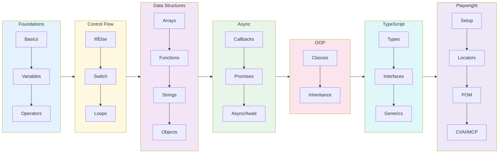
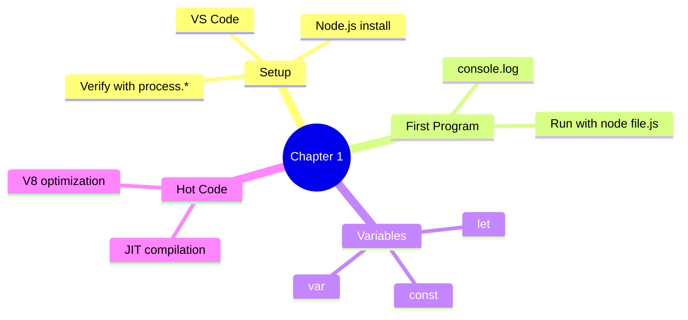
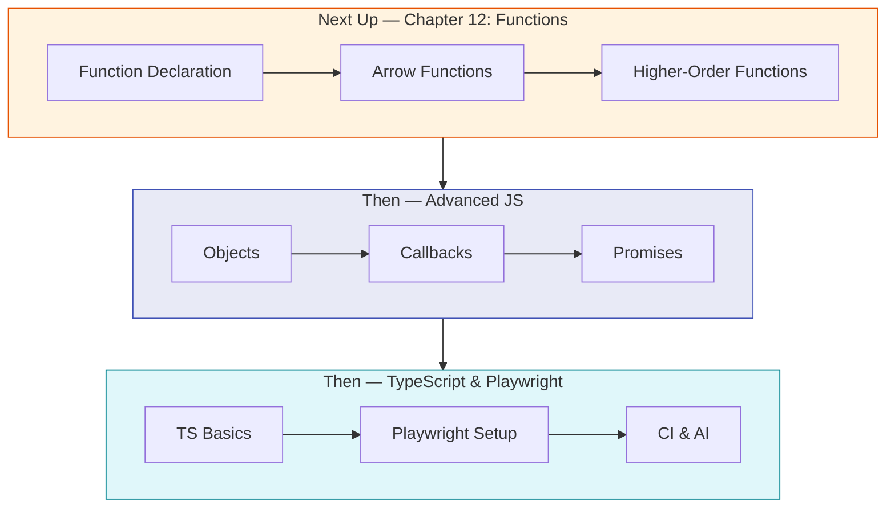
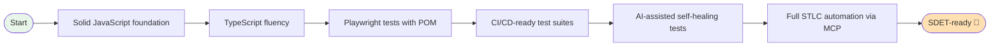
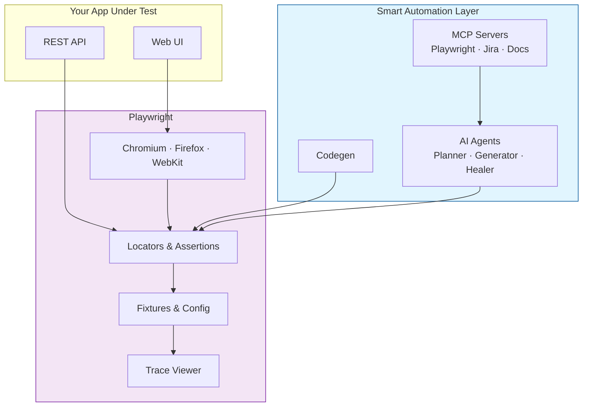

# Learn Playwright Batch 2x

[](https://playwright.dev) [](https://developer.mozilla.org/en-US/docs/Web/JavaScript) [](https://www.typescriptlang.org/) [](https://nodejs.org/) []()

**The official course repository for Batch 2x — JavaScript, TypeScript, and Playwright for SDETs**

*Zero to automation hero — JavaScript fundamentals → TypeScript → Playwright → AI Agents & MCP*

[Quick Start](#-quick-start) · [Curriculum](#-curriculum-roadmap) · [Weekly Plan](#-weekly-plan) · [What You'll Build](#-what-youll-build) · [Resources](#-resources)

---

## Welcome to Batch 2x

This repository is your **week-by-week course companion** for the LearnPlaywright Batch 2x cohort by [The Testing Academy](https://thetestingacademy.com). Code shown in lectures lands here so you can read it, run it, and practice on it.

> Content gets added **as we progress through the batch** — so check back after every class.

### What you'll learn

- **JavaScript Fundamentals** — variables, control flow, arrays, functions, OOP, async
- **TypeScript** — types, interfaces, enums, generics, access modifiers, decorators
- **Playwright** — setup, locators, assertions, fixtures, POM, debugging, CI
- **Modern QA** — Playwright CLI, AI Agents, and MCP for full STLC automation

---

## 🗺️ Curriculum Roadmap

```mermaid
graph TB
    subgraph root["LearnPlaywrightBatch2x"]
        direction TB

        subgraph js["📘 JavaScript (Weeks 1–6)"]
            ch1["Ch 1: Basics ✅"]
            ch2["Ch 2: JS Concepts ✅"]
            ch3["Ch 3: Identifiers & Literals ✅"]
            ch4["Ch 4: Operators & Concepts ✅"]
            ch5["Ch 5: Literals ✅"]
            ch6["Ch 6: Operators ✅"]
            ch7["Ch 7: If / Else ✅"]
            ch8["Ch 8: Switch ✅"]
            ch9["Ch 9: User Input ✅"]
            ch10["Ch 10: Loops ✅"]
            ch11["Ch 11: Arrays ✅"]
            ch12["Ch 12: Functions"]
        end

        subgraph adv["⚙️ Advanced JS (Weeks 7–8)"]
            ch11["Ch 11: Objects"]
            ch12["Ch 12: 2D Arrays"]
            ch13["Ch 13: Callbacks"]
            ch14["Ch 14: Promises"]
            ch15["Ch 15: Async / Await"]
            ch16["Ch 16: OOP - Classes"]
            ch17["Ch 17: Inheritance"]
        end

        subgraph ts["🟦 TypeScript (Week 9)"]
            ch18["Ch 18: TS Fundamentals"]
            ch19["Ch 19: Interfaces"]
            ch20["Ch 20: Enums"]
            ch21["Ch 21: Generics"]
            ch22["Ch 22: Access Modifiers & Decorators"]
        end

        subgraph pw["🎭 Playwright (Weeks 10–12)"]
            ch23["Ch 23: PW Fundamentals"]
            cli["Lecture: Playwright CLI"]
            ai["Lecture: AI Agents"]
            mcp["Lecture: MCP Protocol"]
        end

        subgraph extras["🎯 Bonus"]
            tasks["Interview Coding Questions"]
            tests["Real-world Test Projects"]
        end
    end

    js --> adv --> ts --> pw --> extras

    style js fill:#e1f5fe,stroke:#01579b
    style adv fill:#fff3e0,stroke:#e65100
    style ts fill:#e0f7fa,stroke:#00838f
    style pw fill:#f3e5f5,stroke:#7b1fa2
    style extras fill:#e8f5e9,stroke:#2e7d32
```



---

## 📚 Current Folder Structure

```
LearnPlaywrightBatch2x/
├── Chapter_01_Basics/                  ✅ Hello World, env setup, hot code
│   ├── 01_Basics.js                    # First console.log program
│   ├── 02_JS.js                        # Variables & a simple loop
│   ├── 03_JS_Verify_Setup.js           # Verify Node.js/OS/arch
│   └── 04_HotCode.js                   # JIT & "hot" code paths
│
├── Chapter02_Javascript_Concepts/      ✅ var / let / const & hoisting
│   └── 05_JS_Basics.js
│
├── Chapter03_Identifier_Literals/      ✅ Identifiers, literals, equality
│   ├── 06_Identifier_Rules.js
│   ├── 07_Identifier_Part2.js
│   ├── 08_Comments.js
│   ├── js_identifier_rules.js
│   ├── VS_Code_keyboard_shortcut_windows.md
│   └── VS_Code_keyboard_shortcut_mac.md
│
│
├── Chapter_04_Javascript_Concepts/      ✅ var, let, const, scope, hoisting
│   ├── 09_var_let_const.js               # var/let/const basics & loop leaks
│   ├── 10_functions.js                   # Defining & calling functions
│   ├── 11_var_explained.js               # var: global vs function scope
│   ├── 12_let_peope_love.js              # let: block scope, re-declaration rules
│   ├── 13_const_explained.js             # const: immutability & block scope
│   ├── 14_var_functionscope.js           # var function-scoping in detail
│   ├── 15_let_scope.js                   # let block-scoping in detail
│   ├── 16_Hoisting.js                    # var hoisting with undefined
│   ├── 17_hoisting_fn.js                 # Function-scoped hoisting
│   ├── 18_let_hoisting.js                # let hoisting & Temporal Dead Zone (TDZ)
│   ├── 19_let_hoisting_block.js          # block-scoped let hoisting behavior
│   ├── 20_let_const.js                   # const TDZ demo
│   ├── 21_Jr_QA.js                       # common junior QA interview question
│
├── chapter_05_Literal/                   ✅ Literals — numbers, strings, template literals, null/undefined
│   ├── 22_Literal.js                     # typeof all literal types
│   ├── 23_null_undefined.js              # null vs undefined deep dive
│   ├── 24_null.js                        # null usage examples
│   ├── 25_Literal_All.js                 # integer & hex/octal literals
│   ├── 26_Literal_Number_all.js          # all number types, BigInt, Infinity, NaN
│   ├── 27_String.js                      # single vs double quotes
│   ├── 28_Template_Literal.js            # backticks & variable interpolation
│   └── 29_Backtick_single_double.js      # quote comparison table
│
├── chapter_06_Operator/                  ✅ Operators — arithmetic, comparison, logical, ternary
│   ├── 30_Operator.js                    # Assignment operators
│   ├── 31_Arithmetic_OP.js               # +, -, *, / basics
│   ├── 32_Modulus_OP.js                  # % remainder & odd/even check
│   ├── 33_Expo_OP.js                     # ** exponentiation
│   ├── 34_IQ.js                          # Compound assignment operators
│   ├── 35_Comparsion_OP.js               # >, <, >=, <=, ==, ===
│   ├── 36_Comparsion_Strict_loose.js     # Loose vs strict equality
│   ├── 37_IQ_Loose_Strict.js             # Tricky loose equality gotchas
│   ├── 38_Confusing_Comparsion.js        # Deep dive: == vs === edge cases
│   ├── 39_Logical_Op.js                  # &&, ||, ! logical gates
│   └── 40_String_Con_Op.js               # String concatenation with +=
│
├── chapter_07_If_else/                    ✅ If / Else — conditional statements
│   ├── 48_IF_ESLE.js                     # Basic if/else syntax
│   ├── 49_If_elseif_else.js              # if/else if/else ladder
│   ├── 50_REAL_IF_ELSE.js                # Real-world examples
│   ├── 51_API_IF_ELSE.js                 # API response handling
│   ├── 52_IQ_IF_ELSE.js                  # Interview questions
│   ├── 53_IF_ELSE_real.js                # Practical if/else scenarios
│   ├── 54_IQ.js                          # IQ puzzles with if/else
│   ├── 55_IE.js                          # if/else expressions
│   ├── 56_IQ_EVEN_ODD.js                 # Even/odd checker
│   ├── 57_Grade_Calc.js                  # Grade calculator
│   ├── 58_LEAP_YEAR.js                   # Leap year checker
│   ├── 20May_Task01_http_statusCode.js   # Task: HTTP status categorizer
│   ├── 20May_Task02_passfail_verdict.js  # Task: Pass/fail verdict
│   ├── 20May_Task03_Bug_severity.js      # Task: Bug severity classifier
│   ├── 20May_Task04_BuildHealth_reporter.js  # Task: Build health reporter
│   └── 20May_Task05_Login_Logout.js      # Task: Login/Logout flow
│
├── chapter_08_Switch_Statement/           ✅ Switch — case-based control flow
│   ├── 59_Switch.js                      # Basic switch statement
│   ├── 60_No_Break.js                    # Fall-through behavior
│   ├── 61_Default.js                     # Default case handling
│   ├── 62_REAL_TIME_EXAMPLE.js           # Real-world switch examples
│   ├── 63_Switch_Group.js                # Grouped case statements
│   ├── 64_IQ.js                          # Interview questions
│   ├── 65_IQ2.js                         # More IQ puzzles
│   ├── 66_IQ3.js                         # Switch challenge problems
│   └── 67_IQ4.js                         # Advanced switch patterns
│
├── chapter_09_UserInput/                  ✅ User Input — prompt, readline
│   ├── 68_User_Input.js                   # Browser prompt() input
│   ├── 69_Node_readline.js               # Node.js readline module
│   └── 70_prompt_sync.js                 # Synchronous prompt with prompt-sync
│
├── chapter_10_Loops/                      ✅ Loops — for, while, do...while, for...of, for...in
│   ├── 71_For_loop.js                    # For loop basics
│   ├── 72_For_loop.js                    # For loop variations
│   ├── 73_For_Loop2.js                   # More for loop examples
│   ├── 74_IQ.js                          # Loop interview questions
│   ├── 75_For_OF_IN_EACH.js              # for...of vs for...in
│   ├── 76_While.js                       # While loop basics
│   ├── 77_Do_While.js                    # Do...while loop
│   ├── 78_Do_While.js                    # Do...while variations
│   ├── 79_IQ.js                          # Loop IQ puzzles
│   ├── 80_IQ.js                          # More loop challenges
│   ├── 81_IQ.js                          # Advanced loop problems
│   ├── 82_IQ.js                          # Loop edge cases
│   ├── 22May_Task01_Triangles.js         # Task: Triangle patterns
│   └── 22May_Task02_Fizz_Buzz.js        # Task: FizzBuzz problem
│
├── chapter_11_Arrays/                    ✅ Arrays — creation, access, add/remove, search, iterate, transform
│   ├── 83_Arrays.js                      # Array basics & creation
│   ├── 84_Arrays.js                      # Array constructor methods
│   ├── 85_Access_Array.js                # Accessing & modifying elements
│   ├── 86_Arrays_Adding_Remove.js        # push, pop, unshift, shift
│   ├── 87_Adding_Remove2.js              # splice for add/remove/replace
│   ├── 88_REAL_Example.js                # Real-world array operations
│   ├── 89_Searching.js                   # indexOf, lastIndexOf, includes, find
│   ├── 90_Iterate.js                     # Iterating arrays (for, for...of, forEach, for...in)
│   └── 91_Transform_Array.js             # map, filter, reduce, flat
│
└── README.md                           👋 You are here
```

> **Legend:** ✅ Done · 🚧 Coming soon

---

## 🚀 Quick Start

### Prerequisites

| Tool | Version | Purpose |
|------|---------|---------|
| **Node.js** | 18+ (LTS recommended) | Runs all `.js` files |
| **npm** | Bundled with Node | Package manager |
| **VS Code** | Latest | Recommended editor |
| **Git** | Latest | Clone the repo |

### Setup

```bash
# 1. Clone the repository
git clone https://github.com/PramodDutta/LearnPlaywrightBatch2x.git
cd LearnPlaywrightBatch2x

# 2. Verify your setup
node Chapter_01_Basics/03_JS_Verify_Setup.js

# 3. Run your first JS program
node Chapter_01_Basics/01_Basics.js
```

### Verify it works

```bash
$ node Chapter_01_Basics/01_Basics.js
Hello The Testing Academy
```

If you see that line, you're all set! 🎉

---

## 📅 Weekly Plan


| Week | Topic | Chapters | Outcome |
|------|-------|----------|---------|
| 1 | JS Basics & Setup | Ch 1 | Run Node, write first JS |
| 2 | Variables & Hoisting | Ch 2 | Master `var`/`let`/`const` |
| 3 | Identifiers, Literals, Operators | Ch 3–4 | Read/write any expression |
| 4 | Control Flow | Ch 5–7 | If/else, switch, loops |
| 5 | Arrays & Functions | Ch 11–12 | Manipulate data confidently |
| 6 | Strings & Objects | Ch 10, 13 | Use JS data structures |
| 7 | Async (Callbacks → Promises) | Ch 12–14 | Handle async work |
| 8 | Async/Await + OOP | Ch 15–17 | Modern async, classes |
| 9 | TypeScript | Ch 18–22 | Type-safe automation code |
| 10 | Playwright Fundamentals | Ch 23 | First passing test |
| 11 | Playwright CLI Mastery | CLI Lecture | Codegen, debug, trace |
| 12 | AI Agents + MCP | AI/MCP Lectures | Self-healing, full STLC |

---

## 🧭 Learning Flow



---

## 📖 What's in Chapter 1 (Available Now)

### Files

| File | Topic | What you'll learn |
|------|-------|-------------------|
| `01_Basics.js` | Hello World | First `console.log`, declaring a variable |
| `02_JS.js` | Variables & Loops | Re-declaring with `let`, calling functions inside loops |
| `03_JS_Verify_Setup.js` | Environment Check | `process.platform`, `process.arch`, `process.version` |
| `04_HotCode.js` | Hot Code Paths | How V8 optimizes frequently-called functions |

### Key Concepts



### Run them

```bash
node Chapter_01_Basics/01_Basics.js          # → "Hello The Testing Academy"
node Chapter_01_Basics/02_JS.js              # → counts to 100000 calling print()
node Chapter_01_Basics/03_JS_Verify_Setup.js # → prints platform / arch / node version
node Chapter_01_Basics/04_HotCode.js         # → triggers V8 hot-path optimization
```

---

## 📖 What's in Chapter 2 (Available Now)

### Files

| File | Topic | What you'll learn |
|------|-------|-------------------|
| `05_JS_Basics.js` | Variables & Hoisting | `var` vs `let` vs `const`, hoisting behavior |

### Run it

```bash
node Chapter02_Javascript_Concepts/05_JS_Basics.js
```

---

## 📖 What's in Chapter 3 (Available Now)

### Files

| File | Topic | What you'll learn |
|------|-------|-------------------|
| `06_Identifier_Rules.js` | Identifier Rules | Valid names for variables & functions |
| `07_Identifier_Part2.js` | More Identifiers | Reserved words, naming conventions |
| `08_Comments.js` | Comments | Single-line, multi-line, JSDoc style |
| `js_identifier_rules.js` | Identifier Extras | Additional identifier examples |
| `VS_Code_keyboard_shortcut_windows.md` | VS Code Shortcuts | Windows keyboard cheat sheet |
| `VS_Code_keyboard_shortcut_mac.md` | VS Code Shortcuts | Mac keyboard cheat sheet |

### Run them

```bash
node Chapter03_Identifier_Literals/06_Identifier_Rules.js
node Chapter03_Identifier_Literals/07_Identifier_Part2.js
node Chapter03_Identifier_Literals/08_Comments.js
node Chapter03_Identifier_Literals/js_identifier_rules.js
```

---

## 📖 What's in Chapter 4 (Available Now)

### Files

| File | Topic | What you'll learn |
|------|-------|-------------------|
| `09_var_let_const.js` | var / let / const | Differences, redeclaration, reassignment, loop leaks |
| `10_functions.js` | Functions | Defining and calling functions in JavaScript |
| `11_var_explained.js` | var Scope | Global scope vs function scope, var behavior |
| `12_let_peope_love.js` | let Scope | Block scope, re-declaration rules, loyalty of let |
| `13_const_explained.js` | const | Immutability, block scope, when to use const |
| `14_var_functionscope.js` | var Deep Dive | Function-scoped var in nested blocks |
| `15_let_scope.js` | let Deep Dive | Block-scoped let in nested blocks |
| `16_Hoisting.js` | Hoisting Basics | How var declarations are hoisted with undefined |
| `17_hoisting_fn.js` | Function Hoisting | Function-scoped hoisting behavior |
| `18_let_hoisting.js` | let Hoisting | Temporal Dead Zone (TDZ) with let |
| `19_let_hoisting_block.js` | Block Hoisting | Block-scoped let hoisting behavior |
| `20_let_const.js` | const TDZ | const temporal dead zone demo |
| `21_Jr_QA.js` | Jr QA Question | Common junior QA interview question on hoisting |

### Run them

```bash
node Chapter_04_Javascript_Concepts/09_var_let_const.js
node Chapter_04_Javascript_Concepts/10_functions.js
node Chapter_04_Javascript_Concepts/11_var_explained.js
node Chapter_04_Javascript_Concepts/12_let_peope_love.js
node Chapter_04_Javascript_Concepts/13_const_explained.js
node Chapter_04_Javascript_Concepts/14_var_functionscope.js
node Chapter_04_Javascript_Concepts/15_let_scope.js
node Chapter_04_Javascript_Concepts/16_Hoisting.js
node Chapter_04_Javascript_Concepts/17_hoisting_fn.js
node Chapter_04_Javascript_Concepts/18_let_hoisting.js
node Chapter_04_Javascript_Concepts/19_let_hoisting_block.js
node Chapter_04_Javascript_Concepts/20_let_const.js
node Chapter_04_Javascript_Concepts/21_Jr_QA.js
```

---

## 📖 What's in Chapter 5 (Available Now)

### Files

| File | Topic | What you'll learn |
|------|-------|-------------------|
| `22_Literal.js` | Literal Types | typeof string, number, boolean, null, undefined |
| `23_null_undefined.js` | null vs undefined | Deep dive, comparisons, when to use what |
| `24_null.js` | null Examples | Practical null usage examples |
| `25_Literal_All.js` | Integer Literals | Decimal, hex, octal, exponential notation |
| `26_Literal_Number_all.js` | All Number Types | Binary, BigInt, Infinity, NaN, Number properties |
| `27_String.js` | Strings | Single quotes vs double quotes |
| `28_Template_Literal.js` | Template Literals | Backticks, variable interpolation, real Playwright examples |
| `29_Backtick_single_double.js` | Quote Comparison | Feature table: '' / "" vs `` |

### Run them

```bash
node chapter_05_Literal/22_Literal.js
node chapter_05_Literal/23_null_undefined.js
node chapter_05_Literal/24_null.js
node chapter_05_Literal/25_Literal_All.js
node chapter_05_Literal/26_Literal_Number_all.js
node chapter_05_Literal/27_String.js
node chapter_05_Literal/28_Template_Literal.js
node chapter_05_Literal/29_Backtick_single_double.js
```

---

## 📖 What's in Chapter 6 (Available Now)

### Files

| File | Topic | What you'll learn |
|------|-------|-------------------|
| `30_Operator.js` | Assignment Operators | `=` to assign values to variables |
| `31_Arithmetic_OP.js` | Arithmetic Operators | `+`, `-`, `*`, `/` with variables |
| `32_Modulus_OP.js` | Modulus Operator | `%` remainder, odd/even check |
| `33_Expo_OP.js` | Exponentiation | `**` operator for powers |
| `34_IQ.js` | Compound Operators | `+=`, `-=`, `*=`, `/=`, `%=` shorthand |
| `35_Comparsion_OP.js` | Comparison Operators | `>`, `<`, `>=`, `<=`, `==`, `===` basics |
| `36_Comparsion_Strict_loose.js` | Loose vs Strict | `==` coercion surprises vs `===` safety |
| `37_IQ_Loose_Strict.js` | Tricky Equality | Transitivity breaks, `null`, `undefined` gotchas |
| `38_Confusing_Comparsion.js` | Edge Case Deep Dive | `[]`, `{}`, `NaN`, `null >= 0` and more |
| `39_Logical_Op.js` | Logical Operators | `&&` (AND), `||` (OR), `!` (NOT) |
| `40_String_Con_Op.js` | String Concatenation | Using `+=` to build strings |
| `41_Ternary_Op.js` | Ternary Operator | `? :` conditional expressions |
| `42_Type_Op.js` | Type Operators | `typeof` for all literal types |
| `43_Incre_Decre_Op.js` | Pre Increment / Decrement | `++a`, `--a` behavior |
| `44_Null_Op.js` | Nullish Coalescing | `??` operator and `null` comparisons |
| `45_Post_Incre_Decr op.js` | Post Increment / Decrement | `a++`, `a--` behavior |
| `46_IQ_INCREMENT_D.js` | Interview Questions | Tricky increment / decrement outputs |
| `47_Advance_ID_.js` | Advanced Increment / Decrement | Complex prefix / postfix expressions |
| `18May_Task01_Ternary_Op.js` | Task: Ternary (2 numbers) | Find maximum of two numbers |
| `18May_Task02_Ternary_Op.js` | Task: Ternary (3 numbers) | Find maximum of three numbers |
| `18May_Task03_Incre_Decre_Op.js` | Task: Increment / Decrement | Evaluate complex `++` / `--` expressions |

### Run them

```bash
node chapter_06_Operator/30_Operator.js
node chapter_06_Operator/31_Arithmetic_OP.js
node chapter_06_Operator/32_Modulus_OP.js
node chapter_06_Operator/33_Expo_OP.js
node chapter_06_Operator/34_IQ.js
node chapter_06_Operator/35_Comparsion_OP.js
node chapter_06_Operator/36_Comparsion_Strict_loose.js
node chapter_06_Operator/37_IQ_Loose_Strict.js
node chapter_06_Operator/38_Confusing_Comparsion.js
node chapter_06_Operator/39_Logical_Op.js
node chapter_06_Operator/40_String_Con_Op.js
node chapter_06_Operator/41_Ternary_Op.js
node chapter_06_Operator/42_Type_Op.js
node chapter_06_Operator/43_Incre_Decre_Op.js
node chapter_06_Operator/44_Null_Op.js
node "chapter_06_Operator/45_Post_Incre_Decr op.js"
node chapter_06_Operator/46_IQ_INCREMENT_D.js
node chapter_06_Operator/47_Advance_ID_.js
node chapter_06_Operator/18May_Task01_Ternary_Op.js
node chapter_06_Operator/18May_Task02_Ternary_Op.js
node chapter_06_Operator/18May_Task03_Incre_Decre_Op.js
```

---

## 📖 What's in Chapter 7 (Available Now)

### Files

| File | Topic | What you'll learn |
|------|-------|-------------------|
| `48_IF_ESLE.js` | If / Else Basics | Basic conditional statement syntax |
| `49_If_elseif_else.js` | If / Else If | Multiple condition ladder |
| `50_REAL_IF_ELSE.js` | Real Examples | Practical if/else use cases |
| `51_API_IF_ELSE.js` | API Handling | Using if/else with API responses |
| `52_IQ_IF_ELSE.js` | IQ Questions | Interview-style if/else problems |
| `53_IF_ELSE_real.js` | Practical Scenarios | Real-world conditional logic |
| `54_IQ.js` | IQ Puzzles | Brain teasers with conditionals |
| `55_IE.js` | Expressions | if/else expressions |
| `56_IQ_EVEN_ODD.js` | Even/Odd | Number parity checker |
| `57_Grade_Calc.js` | Grade Calculator | Calculate grades from scores |
| `58_LEAP_YEAR.js` | Leap Year | Check if a year is a leap year |
| `20May_Task01_http_statusCode.js` | Task: HTTP Status | Categorize HTTP status codes |
| `20May_Task02_passfail_verdict.js` | Task: Pass/Fail | Generate test verdicts |
| `20May_Task03_Bug_severity.js` | Task: Bug Severity | Classify bug severity levels |
| `20May_Task04_BuildHealth_reporter.js` | Task: Build Health | Report build health status |
| `20May_Task05_Login_Logout.js` | Task: Login Flow | Simulate login/logout logic |

### Run them

```bash
node chapter_07_If_else/48_IF_ESLE.js
node chapter_07_If_else/49_If_elseif_else.js
node chapter_07_If_else/50_REAL_IF_ELSE.js
node chapter_07_If_else/51_API_IF_ELSE.js
node chapter_07_If_else/52_IQ_IF_ELSE.js
node chapter_07_If_else/53_IF_ELSE_real.js
node chapter_07_If_else/54_IQ.js
node chapter_07_If_else/55_IE.js
node chapter_07_If_else/56_IQ_EVEN_ODD.js
node chapter_07_If_else/57_Grade_Calc.js
node chapter_07_If_else/58_LEAP_YEAR.js
node chapter_07_If_else/20May_Task01_http_statusCode.js
node chapter_07_If_else/20May_Task02_passfail_verdict.js
node chapter_07_If_else/20May_Task03_Bug_severity.js
node chapter_07_If_else/20May_Task04_BuildHealth_reporter.js
node chapter_07_If_else/20May_Task05_Login_Logout.js
```

---

## 📖 What's in Chapter 8 (Available Now)

### Files

| File | Topic | What you'll learn |
|------|-------|-------------------|
| `59_Switch.js` | Switch Basics | Basic switch statement syntax |
| `60_No_Break.js` | Fall-through | Behavior without break keyword |
| `61_Default.js` | Default Case | Handling unmatched cases |
| `62_REAL_TIME_EXAMPLE.js` | Real Examples | Practical switch use cases |
| `63_Switch_Group.js` | Grouped Cases | Multiple cases with same output |
| `64_IQ.js` | IQ Questions | Interview-style switch problems |
| `65_IQ2.js` | More IQ | Additional switch puzzles |
| `66_IQ3.js` | Challenges | Switch statement challenges |
| `67_IQ4.js` | Advanced | Complex switch patterns |

### Run them

```bash
node chapter_08_Switch_Statement/59_Switch.js
node chapter_08_Switch_Statement/60_No_Break.js
node chapter_08_Switch_Statement/61_Default.js
node chapter_08_Switch_Statement/62_REAL_TIME_EXAMPLE.js
node chapter_08_Switch_Statement/63_Switch_Group.js
node chapter_08_Switch_Statement/64_IQ.js
node chapter_08_Switch_Statement/65_IQ2.js
node chapter_08_Switch_Statement/66_IQ3.js
node chapter_08_Switch_Statement/67_IQ4.js
```

---

## 📖 What's in Chapter 9 (Available Now)

### Files

| File | Topic | What you'll learn |
|------|-------|-------------------|
| `68_User_Input.js` | Browser Input | Using `prompt()` in browser environments |
| `69_Node_readline.js` | Node Readline | Using Node.js readline module |
| `70_prompt_sync.js` | Synchronous Prompt | Using prompt-sync package |

### Run them

```bash
node chapter_09_UserInput/68_User_Input.js
node chapter_09_UserInput/69_Node_readline.js
node chapter_09_UserInput/70_prompt_sync.js
```

---

## 📖 What's in Chapter 10 (Available Now)

### Files

| File | Topic | What you'll learn |
|------|-------|-------------------|
| `71_For_loop.js` | For Loop Basics | Basic `for` loop syntax and usage |
| `72_For_loop.js` | For Loop Variations | Different ways to write for loops |
| `73_For_Loop2.js` | More For Loops | Additional for loop examples |
| `74_IQ.js` | IQ Questions | Interview-style loop problems |
| `75_For_OF_IN_EACH.js` | for...of vs for...in | Iterating arrays and objects |
| `76_While.js` | While Loop | Basic `while` loop syntax |
| `77_Do_While.js` | Do...While Loop | `do...while` loop basics |
| `78_Do_While.js` | Do...While Variations | More do...while examples |
| `79_IQ.js` | Loop IQ Puzzles | Tricky loop problems |
| `80_IQ.js` | More Loop Challenges | Additional loop puzzles |
| `81_IQ.js` | Advanced Loop Problems | Complex loop scenarios |
| `82_IQ.js` | Loop Edge Cases | Edge cases with loops |
| `22May_Task01_Triangles.js` | Task: Triangles | Print triangle patterns with loops |
| `22May_Task02_Fizz_Buzz.js` | Task: FizzBuzz | Classic FizzBuzz problem |

### Run them

```bash
node chapter_10_Loops/71_For_loop.js
node chapter_10_Loops/72_For_loop.js
node chapter_10_Loops/73_For_Loop2.js
node chapter_10_Loops/74_IQ.js
node chapter_10_Loops/75_For_OF_IN_EACH.js
node chapter_10_Loops/76_While.js
node chapter_10_Loops/77_Do_While.js
node chapter_10_Loops/78_Do_While.js
node chapter_10_Loops/79_IQ.js
node chapter_10_Loops/80_IQ.js
node chapter_10_Loops/81_IQ.js
node chapter_10_Loops/82_IQ.js
node chapter_10_Loops/22May_Task01_Triangles.js
node chapter_10_Loops/22May_Task02_Fizz_Buzz.js
```

---

## 📖 What's in Chapter 11 (Available Now)

### Files

| File | Topic | What you'll learn |
|------|-------|-------------------|
| `83_Arrays.js` | Array Basics | Creating arrays, empty arrays, mixed types |
| `84_Arrays.js` | Array Creation | Array literal, constructor, `Array.of()`, `Array.from()` |
| `85_Access_Array.js` | Access & Modify | Index access, `at()`, negative indexing, modifying elements |
| `86_Arrays_Adding_Remove.js` | Add/Remove Basics | `push()`, `pop()`, `unshift()`, `shift()` |
| `87_Adding_Remove2.js` | Splice | `splice()` for add, remove, and replace operations |
| `88_REAL_Example.js` | Real Example | Practical array operations with browser lists |
| `89_Searching.js` | Searching | `indexOf()`, `lastIndexOf()`, `includes()`, `find()`, `findIndex()`, `findLast()`, `findLastIndex()` |
| `90_Iterate.js` | Iteration | `for`, `for...of`, `forEach()`, `for...in`, `entries()` |
| `91_Transform_Array.js` | Transform | `map()`, `filter()`, `reduce()`, `flat()` |

### Run them

```bash
node chapter_11_Arrays/83_Arrays.js
node chapter_11_Arrays/84_Arrays.js
node chapter_11_Arrays/85_Access_Array.js
node chapter_11_Arrays/86_Arrays_Adding_Remove.js
node chapter_11_Arrays/87_Adding_Remove2.js
node chapter_11_Arrays/88_REAL_Example.js
node chapter_11_Arrays/89_Searching.js
node chapter_11_Arrays/90_Iterate.js
node chapter_11_Arrays/91_Transform_Array.js
```

---

## 🔭 What's Coming Next



---

## 🎯 What You'll Build (by the end)



By graduation you'll have:

- ✅ A complete JavaScript + TypeScript portfolio
- ✅ Production-grade Playwright test suites with the Page Object Model
- ✅ Hands-on experience with **Playwright CLI**, **codegen**, **trace viewer**
- ✅ Real projects using **AI agents** (Planner / Generator / Healer)
- ✅ End-to-end **MCP-driven STLC automation** (Playwright + Jira + reports)
- ✅ Interview prep — coding questions + Q&A banks

---

## 🧩 How Playwright Fits In (Big Picture)



---

## 🛠️ Useful Commands (You'll Use These Soon)

```bash
# JavaScript
node <file.js>                           # Run any chapter file

# TypeScript (Week 9+)
npx tsc <file.ts>                        # Compile TS → JS
npx ts-node <file.ts>                    # Run TS directly

# Playwright (Week 10+)
npm init playwright@latest               # Scaffold Playwright project
npx playwright test                      # Run all tests
npx playwright test --ui                 # Interactive UI mode
npx playwright test --debug              # Debug with inspector
npx playwright codegen <url>             # Record a test
npx playwright show-report               # Open HTML report
npx playwright show-trace <trace.zip>    # Open trace viewer
```

---

## 📘 Recommended Study Habit

| Day | Activity |
|-----|----------|
| **Class day** | Watch the live class, take notes |
| **Day +1** | Re-run every example from the chapter folder |
| **Day +2** | Solve 2–3 interview-style problems on the topic |
| **Day +3** | Build a tiny project applying the concept |
| **Weekend** | Recap the week — re-read code, ask doubts in the group |

> **Rule of thumb:** Don't move to the next chapter until you can explain the previous one out loud.

---

## 🔗 Resources

- 📺 [The Testing Academy YouTube](https://youtube.com/@TheTestingAcademy)
- 🌐 [thetestingacademy.com](https://thetestingacademy.com)
- 📚 [Playwright Docs](https://playwright.dev/docs/intro)
- 📚 [TypeScript Handbook](https://www.typescriptlang.org/docs/handbook/intro.html)
- 📦 [Reference Repo — Batch 1](https://github.com/PramodDutta/LearningPlaywrightBatch)

---

## 🙋 Project Info

| | |
|---|---|
| **Author** | Pramod Dutta |
| **Organization** | The Testing Academy |
| **Batch** | 2x (in progress) |
| **Stack** | JavaScript · TypeScript · Playwright · Node 18+ |

---

**Happy learning, future SDETs! 🚀**

*Code with intent. Test with confidence. Automate with joy.*

— Pramod & The Testing Academy team
